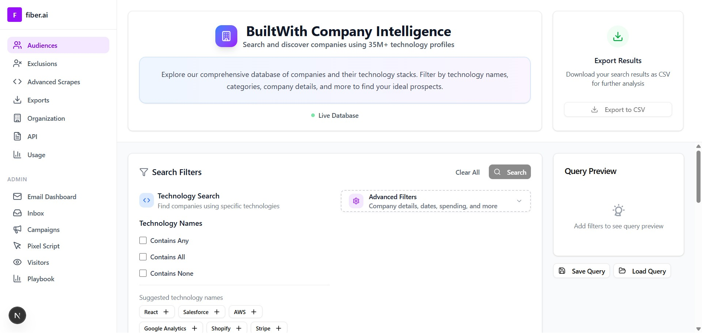

This submission is for Kaustav Chanda (GitHub username = 'kstv364').

# BuiltWith Company Intelligence Application Documentation

## Introduction

The BuiltWith Company Intelligence application is a powerful tool designed to help users search and discover companies based on their technology profiles. It provides a comprehensive database of over 35 million companies, allowing users to apply various filters to narrow down their search and export results for further analysis.

## Application Screenshot

*The main interface showing the search filters, query preview, and results table with various technology and category options available.*

Alternative image link (if above doesn't load)

## Key Features

### 1. Technology Search Filters
- **Multi-Value Filter Options**: Choose from three filter types for technology searches:
  - **Contains Any**: Find companies using at least one of the specified technologies
  - **Contains All**: Find companies using all of the specified technologies  
  - **Contains None**: Exclude companies using any of the specified technologies
- **Technology Names**: Search for specific technologies (e.g., React, AWS, Salesforce, Stripe, Shopify)
- **Technology Categories**: Filter by technology categories (e.g., Analytics, CRM, E-commerce, Marketing Automation, Cloud Services, Security)
- **Intelligent Typeahead**: All search fields feature smart autocomplete suggestions powered by the live database
- **Suggested Values**: Quick-add buttons for popular technologies and categories
- **Clear All Filters**: Reset all applied filters with a single click to start a new search

### 2. Advanced Search Criteria & Robust Filtering
- **Comprehensive Field Support**: Search across all company and technology data points:
  - **Company Fields**: Company Name, Domain, Category, Country, City, State/Province, Postal Code, Company Spend
  - **Technology Fields**: Technology Name, Category, Parent Technology, Premium/Free status, Technology Description  
  - **Temporal Fields**: First Indexed Date, Last Indexed Date (when technologies were first/last detected)
- **Smart Typeahead for All Fields**: Every text input field provides intelligent autocomplete suggestions from the live database
- **Advanced Operators**: Support for multiple comparison operators:
  - **Text Fields**: equals, not equals, contains, in list, not in list
  - **Numeric Fields**: equals, not equals, greater than, less than, greater than or equal, less than or equal, between, in list, not in list
  - **Date Fields**: equals, not equals, after, before, on or after, on or before, between dates
  - **Boolean Fields**: is, is not (for premium technology status)
- **Complex Query Building**: Combine multiple conditions with AND/OR logic to create sophisticated search queries
- **Multi-Value Inputs**: Add multiple values to single fields (e.g., search for companies in "USA, Canada, UK")
- **Range Queries**: Support for BETWEEN operations on dates and numeric fields (e.g., spend between $10,000-$50,000)

### 3. Query Preview & Management
- **Real-time Query Updates**: See a live preview of your search query as you add or modify filters
- **SQL-like Preview**: View the structured query that will be executed against the database
- **Save/Load Queries**: Save your frequently used or complex queries for quick access and reuse
- **Query Persistence**: Saved queries are stored locally and persist across browser sessions

### 4. Search Results & Table Features
- **Interactive Results Table**: View search results in a feature-rich, sortable table
- **Bi-directional Sorting**: Click column headers to sort ascending/descending (toggle between states)
- **Column-level Filtering**: Filter results within each table column with dedicated search inputs
- **Show/Hide Column Filters**: Toggle visibility of column filter inputs to reduce visual clutter
- **Real-time Table Filtering**: Filter displayed results without re-querying the database
- **Horizontal Scrolling**: Table automatically provides horizontal scrollbar for wide datasets
- **Pagination Controls**: Navigate through large datasets with intuitive pagination
- **Result Count Display**: See total results and current page information
- **No Results Handling**: Clear messages and helpful suggestions when no companies match criteria
- **Responsive Table Design**: Table adapts to different screen sizes while maintaining functionality

### 5. Export Functionality
- **CSV Export**: Download your complete search results as a CSV file for offline analysis
- **Export Dialog**: Dedicated dialog with export options and record count information
- **Large Dataset Support**: Export all matching records, not just the current page view
- **Export Button States**: Export button is intelligently enabled/disabled based on search results availability

### 6. User Experience Features
- **Intelligent Autocomplete**: Every search field provides real-time suggestions from the live database
- **Visual Feedback**: Clear indicators show filter states, search progress, and result counts
- **Responsive Design**: Fully responsive interface optimized for desktop, tablet, and mobile devices
- **Loading States**: Clear loading indicators during search operations
- **Error Handling**: Graceful handling of API errors with user-friendly messages
- **Filter Management**: Easy-to-use controls for adding, removing, and clearing filters
- **Status Indicators**: Live database status and applied filter counts displayed prominently

## How to Use

1.  **Navigate to the Application**: Open the application in your web browser.

2.  **Apply Technology Filters**:
    *   In the "Technology Search" section, choose your filter type:
        - Check "Contains Any" to find companies using at least one of your specified technologies
        - Check "Contains All" to find companies using all specified technologies  
        - Check "Contains None" to exclude companies using any specified technologies
    *   Click on suggested technology buttons (e.g., "React +", "AWS +", "Salesforce +") to quickly add them
    *   Or type in the input field to use intelligent typeahead suggestions from the live database
    *   Repeat for "Technology Categories" section if desired (e.g., Analytics, CRM, E-commerce)

3.  **Advanced Filtering** (Optional):
    *   Click "Advanced Filters" to access additional search criteria
    *   Choose from Company fields (name, domain, location, spend) or Technology fields (description, premium status, dates)
    *   Select appropriate operators (equals, contains, greater than, between, etc.)
    *   Use typeahead suggestions available in all text fields
    *   Add multiple conditions using AND/OR logic

4.  **View Query Preview**: The "Query Preview" section updates in real-time showing your current search structure

5.  **Perform Search**: Click the "Search" button once you've applied your desired filters

6.  **Interact with Results**:
    *   **Sort**: Click any column header to sort results (click again to reverse order)
    *   **Filter Table**: Click "Show Filters" to enable column-level filtering within results
    *   **Navigate**: Use pagination controls to browse through large result sets
    *   **Scroll**: Use horizontal scrollbar if table is wider than screen

7.  **Export Results**: Click "Export to CSV" to download your complete result set (all pages)

8.  **Manage Queries**:
    *   Click "Save Query" to store your current filter configuration
    *   Click "Load Query" to retrieve and apply previously saved searches
    *   Click "Clear All" in any filter section to reset and start over
