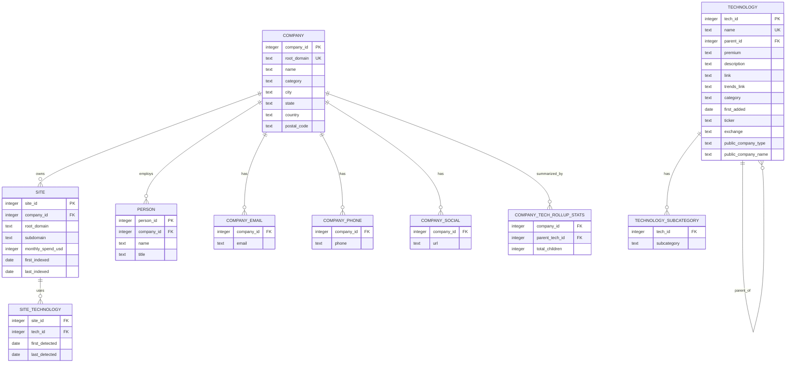

```mermaid
erDiagram
  COMPANY ||--o{ SITE : owns
  COMPANY ||--o{ PERSON : employs
  COMPANY ||--o{ COMPANY_EMAIL : has
  COMPANY ||--o{ COMPANY_PHONE : has
  COMPANY ||--o{ COMPANY_SOCIAL : has
  TECHNOLOGY ||--o{ TECHNOLOGY_SUBCATEGORY : has
  SITE ||--o{ SITE_TECHNOLOGY : uses
  TECHNOLOGY ||--o{ TECHNOLOGY : parent_of
  COMPANY ||--o{ COMPANY_TECH_ROLLUP_STATS : summarized_by

  COMPANY {
    integer company_id PK
    text root_domain UK
    text name
    text category
    text city
    text state
    text country
    text postal_code
  }

  PERSON {
    integer person_id PK
    integer company_id FK
    text name
    text title
  }

  COMPANY_EMAIL {
    integer company_id FK
    text email
  }

  COMPANY_PHONE {
    integer company_id FK
    text phone
  }

  COMPANY_SOCIAL {
    integer company_id FK
    text url
  }

  TECHNOLOGY {
    integer tech_id PK
    text name UK
    integer parent_id FK
    text premium
    text description
    text link
    text trends_link
    text category
    date first_added
    text ticker
    text exchange
    text public_company_type
    text public_company_name
  }

  TECHNOLOGY_SUBCATEGORY {
    integer tech_id FK
    text subcategory
  }

  SITE {
    integer site_id PK
    integer company_id FK
    text root_domain
    text subdomain
    integer monthly_spend_usd
    date first_indexed
    date last_indexed
  }

  SITE_TECHNOLOGY {
    integer site_id FK
    integer tech_id FK
    date first_detected
    date last_detected
  }

  COMPANY_TECH_ROLLUP_STATS {
    integer company_id FK
    integer parent_tech_id FK
    integer total_children
  }
```